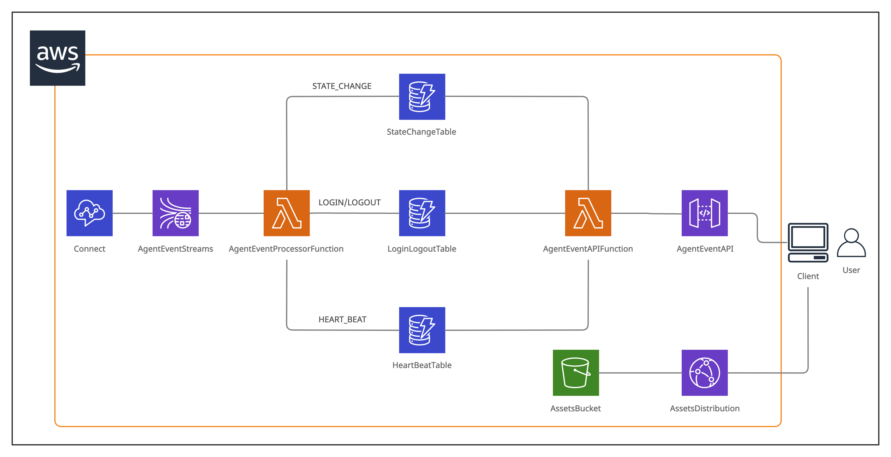
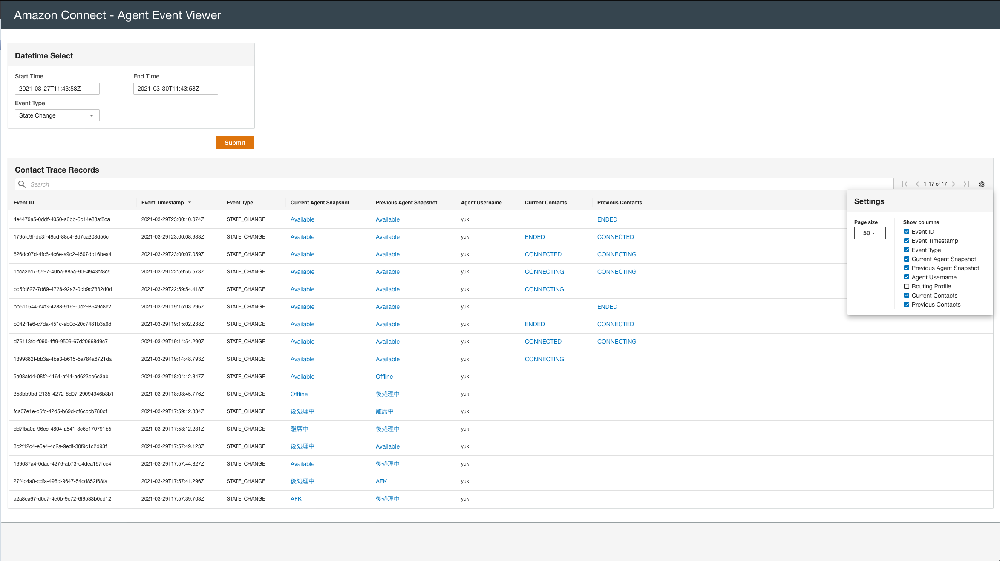

# Agent Event Streams Application

## Description
This enables you to easily build and deploy backend and frontend for Agent Event Sterams in Amazon Connect. <br>
The picture below describes the high-level architecture of this application.




## Deployment Steps

### Option 1: Use CodePipeline to automate your deployment (Recommended)
------------
**Step 1. Download the source and make CodeCommit repository in your AWS account**<br>

First, you need to clone this repository and push it into your own CodeCommit repository. <br>
To create your CodeCommit repository, please refer to the documentation below.

- Create an AWS CodeCommit repository<br>
https://docs.aws.amazon.com/codecommit/latest/userguide/how-to-create-repository.html

To learn how to push your code into your CodeCommit repository inlcuding the initial setup, please refer to the documenteation below.

- Setup steps for SSH connections to AWS CodeCommit repositories on Linux, macOS, or Unix<br> 
https://docs.aws.amazon.com/codecommit/latest/userguide/setting-up-ssh-unixes.html

<br>

**Step 2. Create a S3 Bucket for CodePipeline Artifact Store**<br>

Next, you need to create a S3 Bucket that will be used as CodePipeline Artifact Store. You can simply utilize AWS CLI command to do so. <br>
Please note that the artifact store must be in the same region as your CodePipeline pipeline will be located. 

```
$ aws s3 mb s3://<your-bucket-name> --region <your region>
```

<br>

**Step 3. Create a CloudFormation Stack**<br>

After completion of creating your CodeCommit repository and artifact store, create a CloudFormation stack that creates CodePipeline pipeline to automate your build and deployment. Detailed steps are descrebed below. <br>

1. Find a template file ```<Repository Root>/pipeline/template.yaml```
2. Create a CloudFormation stack with the template. Parameters should be filled as follows:<br>
<i>ArtifactStoreS3Location</i>: The name of the S3 Bucket you created in Step 2<br>
<i>BranchName</i>: The name of the branch name of your CodeCommit repository<br>
<i>CodeCommitRepository</i>: The name of your CodeCommit repository<br>

3. Wait for CodePipeline pipeline to be created. 

After the completion of the stack, the newly created CodePipeline pipeline will be executed automatically and build/deploy backend and frontend for this application. <br>
If your CloudFormation stack or pipeline failed to execute, please troubleshoot the problem by refering to each documentation. 

<br>

**Step 4. Specify Kinesis Data Streams for the data streaming in Amazon Connect and make some tests**<br>

To enable data streaming in Amazon Connect, go to your Amazon Connect Instance page by clicking your instance alias in AWS Management Console, then select the menu ```Data streaming``` on the left. For ```Agent Events```, specify the Kinesis Stream that was created by your CloudFormation stack. <br>
To confirm if agent events are fetched into DynamoDB tables properly, change the agent state, login and logout, and make some calls, then check DynamoDB tables to find those events. <br>
Please note that agent events are fetched into different DynamoDB tables according to the event types as follows.<br>
* STATE_CHANGE: AgentStateChangeTable-AgentEventApplication
* LOGIN/LOGOUT: AgentLoginLogoutTable-AgentEventApplication
* HEART_BEAT: AgentHeartBeatTable-AgentEventApplication

For event types in Agent Event Streams, please refer to the documentation below.

- Agent event streams data model<br>
https://docs.aws.amazon.com/connect/latest/adminguide/agent-event-stream-model.html

<br>

### Option 2: Use SAM CLI and CloudFormation to deploy the appliction
------------
**Step 1. Download the source**<br>

First, you need to clone this repository. You can simply to do so with ```git clone``` command. 

<br>

**Step 2. Deploy backend environment with SAM CLI**<br>

Next, you need to deploy backend environment with SAM CLI. <br>
Go to ```<Repository Root>/agent-event-processor/```, then do followings.

```
$ sam build
$ sam deploy --guided
```

Follow the instruction of ```sam deploy``` command, and deploy the backend. <br>
After the completion of the deployment, you will see the output ```AgentEventApi``` value as ```https://xxxxxxxxxx.execute-api.<region>.amazonaws.com/Prod/agent_event``` that will be used in the later step.

For installation of SAM CLI, please follow the documentation below.

* Installing the AWS SAM CLI<br>
https://docs.aws.amazon.com/serverless-application-model/latest/developerguide/serverless-sam-cli-install.html

<br>

**Step 3. Create a CloudFormation Stack for frontend hosting environment**<br>

If you go to ```<Repository Root>/agent-event-viewer/hosting/```, you will see ```template.yaml``` file. Use this file to create a CloudFormation Stack to deploy the frontend hosting environment that consists of CloudFront + S3. <br>
After the completion of the deployment, you will see the output ```URL``` value as ```https://xxxxxxxxxxxxxx.cloudfront.net``` which is the URL for the frontend application. Also, you will see ```AssetsBucket``` which is the S3 Bucket that stores the application contents.

<br>

**Step 4. Build and deploy the frontend appliction**<br>

Go to ```<Repository Root>/agent-event-viewer/```, then create a file ```.env``` with the following content.

[ ```<Repository Root>/agent-event-viewer/.env``` ]
```
REACT_APP_AGENT_EVENT_API="https://xxxxxxxxxx.execute-api.us-west-2.amazonaws.com/Prod/agent_event"
```

Please note that the URL is the one you obtained in the Step 2. <br>

Next, do following commands in the same directory to build and deploy your application. 

```
$ npm install
$ npm run build
$ aws s3 sync ./build s3://<Your S3 Bucket>
```

Please note that the S3 Bucket you specify here is the one you obtained in the Step 3 as ```AssetsBucket```. 

<br>

**Step 5. Specify Kinesis Data Streams for the data streaming in Amazon Connect and make some tests**<br>

To enable data streaming in Amazon Connect, go to your Amazon Connect Instance page by clicking your instance alias in AWS Management Console, then select the menu ```Data streaming``` on the left. For ```Agent Events```, specify the Kinesis Stream that was created by your CloudFormation stack. <br>
To confirm if agent events are fetched into DynamoDB tables properly, change the agent state, login and logout, and make some calls, then check DynamoDB tables to find those events. <br>
Please note that agent events are fetched into different DynamoDB tables according to the event types as follows.<br>
* STATE_CHANGE: AgentStateChangeTable-AgentEventApplication
* LOGIN/LOGOUT: AgentLoginLogoutTable-AgentEventApplication
* HEART_BEAT: AgentHeartBeatTable-AgentEventApplication

For event types in Agent Event Streams, please refer to the documentation below.

- Agent event streams data model<br>
https://docs.aws.amazon.com/connect/latest/adminguide/agent-event-stream-model.html

<br>


## Play with agent events

If you used CodePipeline to deploy the app, go look at the output of the CloudFormation stack ```AgentEventViewerHosting-[The first stack name]```. You will find ```URL``` gives you CloudFront URL like ```https://xxxxxxxxxxxxxx.cloudfront.net``` which is where the frontend application is hosted. <br>
If you manually built and deployed the app with SAM CLI and CloudFormation, you've already obtained the URL in the Step 3. <br>
Open the app in your browser and play with agent events in Amazon Connect!<br>
Also, if you are interested, modify the frontend app to customize Agent Event Streams experience as you like, which leads to your better understanding on the concept. 

